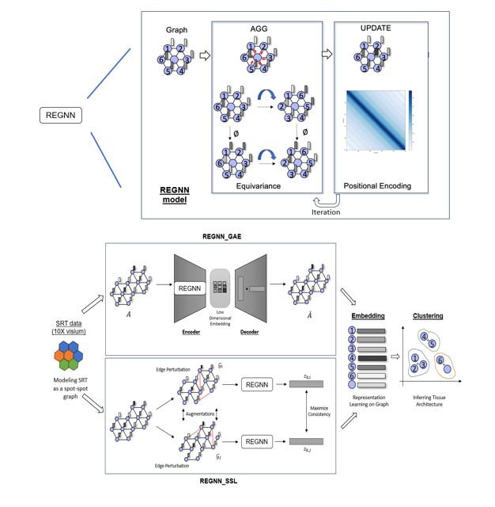

# REGNN
REGNN (Relation Equivariant Graph Neural Networks) is a graph deep learning framework for spatially resolved transcriptomics data analyses on heterogeneous tissue structures. 



### Software Requirements

#### OS Requirements
``` REGNN ``` was tested on on Windows 11 12th Gen Intel(R) i7-1265U.

#### Python Dependencies
``` REGNN ``` requires Python 3.7+ and the installation of PyTorch 1.5.0. Additional python package dependencies can be found in 'requirements.txt'.

#### Installation Guide
1. Clone repository onto your local system
    ```
    git clone https://github.com/Mraina99/REGNN.git
    ```

2. Navigate to the REGNN directory
    ```
    cd REGNN
    ```

3. Install ```PyTorch 1.5.0``` 
    ```
    # Conda Install
    conda install pytorch==1.5.0 torchvision==0.6.0 cpuonly -c pytorch

    # Pip Install
    pip install torch==1.5.0+cpu torchvision==0.6.0+cpu -f https://download.pytorch.org/whl/torch_stable.html
    ```
    For more information on Pytorch, please check their [official guide](https://pytorch.org/get-started/previous-versions/#linux-and-windows-9).

4. Install the additional package dependencies:
    ```
    pip install -r requirements.txt
    ```

### Demo

Kidney data can be downloaded from the [KPMP repository](https://atlas.kpmp.org/repository/). 

For example data, unzip V10S14-085_XY04_21-0057.zip within the 'Data/' subdirectory. Make sure that the unzipped files in 'Data/' directory within a folder that corresponds with the example file directory tree below (ex. Data/V10S14-085_XY04_21-0057/). Store the required data files within the dataset subdirectory and ensure that SRT data follows the required data formats specifed below.

#### Required data formats
* Expression file (Name as: count.csv): Rows as spot barcodes, Columns as genes
* Coordinates file (Name as: spa.csv): Two columns with spatial x,y coordinates corresponding to each spot

##### Optional data
* Label/Annotation file (Name as: labels.csv): Rows as spot barcodes, Columns as labels, with 'class' being the name of the column with spot labels/annotations.

Example of File Directory:
```md
REGNN
├── Data/
│   └── V10S14-085_XY04_21-0057/
│       ├── count.csv
│       └── spa.csv
└── REGNN_run/
    └── results/
        ├── Cluster_labels/
        └── Embeddings/
```

#### Run REGNN
Both versions of REGNN will return their results in the 'result' folder of the REGNN_run directory. 'Embeddings/' subdirectory will contrain final embeddings generated by REGNN, and 'Cluster_Labels/' will contain the final clusters. Multiple files will be generated for each PE_alpha and zDim combination.

To run REGNN_GAE, run the following command:
```
python REGNN.py --load_dataset_name V10S14-085_XY04_21-0057 --select_method GAE
```

To run REGNN_SSL, run the following command:
```
python REGNN.py --load_dataset_name V10S14-085_XY04_21-0057 --select_method SSL
```

#### Useful Arguements for REGNN_run.py
* --load_dataset_name: Name of the data/dataset being tested. Make sure this matches the folder in the Data/ subdirectory which you want to test.
    * (ex. --load_dataset_name V10S14-085_XY04_21-0057)
* --load_annotation_bool: If including annotation file to retrieve ARI scores. Default is False. 
    * (ex.  --load_annotation_bool True)
* --select_method: Whether to run REGNN_GAE or REGNN_SSL
    * (ex. --select_method SSL)
* --n_clusters: Number of final clusters. If including annotation file, will by default set n_clusters to number of classes in annotation file
    * (ex. --n_clusters 4)


### Reference
<<<<<<< HEAD
1. Chang, Y., et al., Define and visualize pathological architectures of human tissues from spatially resolved transcriptomics using deep learning. Comput Struct Biotechnol J, 2022. 20: p. 4600-4617.
2. This research was supported in part by Lilly Endowment, Inc., through its support for the Indiana University Pervasive Technology Institute.
3. de Boer, I.H., et al., Rationale and design of the Kidney Precision Medicine Project. Kidney Int, 2021. 99(3): p. 498-510.

[](https://doi.org/10.5281/zenodo.15268106)
=======
1. Raina, M., Cheng, H., Ferreira, R. M., Stansfield, T., Modak, C., Cheng, Y. H., ... & Wang, J. (2025). Relation Equivariant Graph Neural Networks to Explore the Mosaic-like Tissue Architecture of Kidney Diseases on Spatially Resolved Transcriptomics. Bioinformatics, btaf303. [https://academic.oup.com/bioinformatics/advance-article/doi/10.1093/bioinformatics/btaf303/8129567]
>>>>>>> REGNN_Publication_Update
