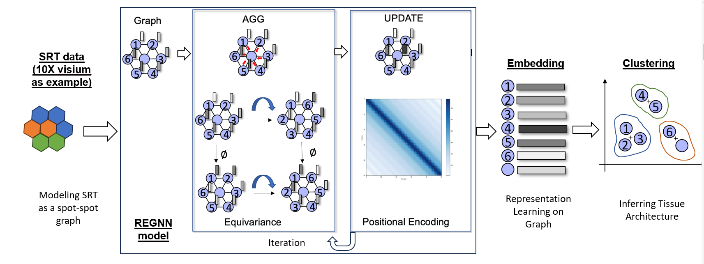

# REGNN
REGNN (Relation Equivariant Graph Neural Networks) is a graph deep learning framework for spatially resolved transcriptomics data analyses on heterogeneous tissue structures. 



### Software Requirements

#### OS Requirements
``` REGNN ``` was tested on IU's Linux based supercomputer BigRed200<sup>2</sup> on a 64-core CPU compute node with 200GB RAM.

#### Python Dependencies
``` REGNN ``` requires Python 3.7+ and the installation of PyTorch 1.5.0 and mmcv-full 1.3.0. Additional python package dependencies can be found in 'requirements.txt'.

#### Installation Guide
1. Install ```PyTorch 1.5.0``` 
    ```
    # Conda Install
    conda install pytorch==1.5.0 torchvision==0.6.0 cpuonly -c pytorch

    # Pip Install
    pip install torch==1.5.0+cpu torchvision==0.6.0+cpu -f https://download.pytorch.org/whl/torch_stable.html
    ```
    [official guide](https://pytorch.org/get-started/previous-versions/#linux-and-windows-9).
2. Install ```mmcv-full 1.3.0``` using the following command:
    ```
    pip install mmcv-full==1.3.0 -f https://download.openmmlab.com/mmcv/dist/cpu/torch1.5.0/index.html
    ```
3. Install the additional package dependencies:
    ```
    pip install -r requirements.txt
    ```

### Demo

Place SRT data in data/ directory within a folder that corresponds with the sample or data name (ex. data/V10S14-085_XY04_21-0057/). Ensure that SRT data follows the required data formats specifed below.

#### Required data formats
* Expression file (Name as: count.csv): Rows as spot barcodes, Columns as genes
* Coordinates file (Name as: spa.csv): Two columns with spatial x,y coordinates corresponding to each spot
* Label/Annotation file (Name as: labels.csv): Rows as spot barcodes, Columns as labels, with 'class' being the name of the column with spot labels/annotations.

#### Run REGNN
To run REGNN and recieve ARI scoring results, run the following:
```
python calculate_ARI.py
```

#### Paper Results
``` REGNN ``` was tested on 10X Visium SRT data from the KPMP (Kidney Precision Medicine Project) Atlas<sup>3</sup> . Results from running Kidney sample V10S14-085_XY04_21-0057 - CKD can be found in 'results' directory, in files 'all_results.csv' & 'ARI_table.csv'

### Reference
1. Chang, Y., et al., Define and visualize pathological architectures of human tissues from spatially resolved transcriptomics using deep learning. Comput Struct Biotechnol J, 2022. 20: p. 4600-4617.
2. This research was supported in part by Lilly Endowment, Inc., through its support for the Indiana University Pervasive Technology Institute.
3. de Boer, I.H., et al., Rationale and design of the Kidney Precision Medicine Project. Kidney Int, 2021. 99(3): p. 498-510.